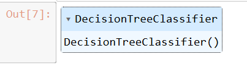
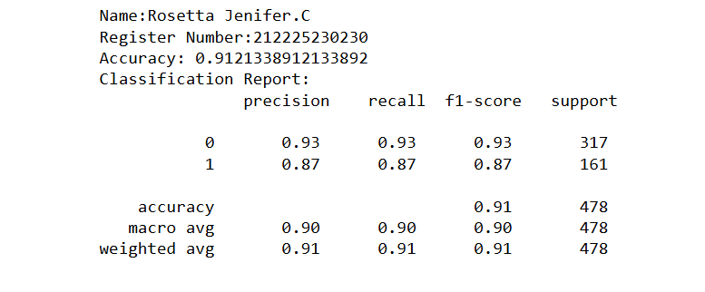
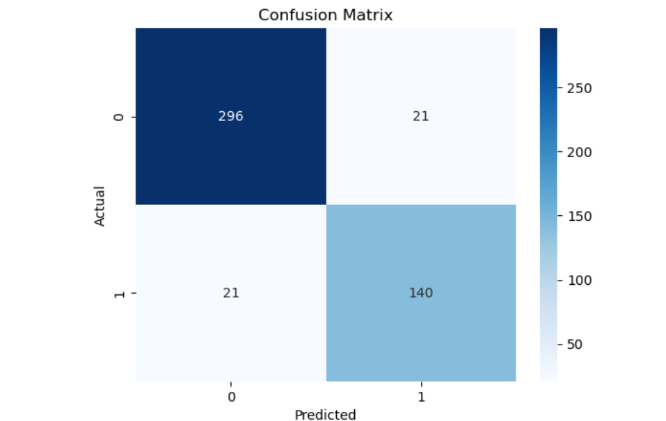

# BLENDED_LEARNING
# Implementation of Decision Tree Model for Tumor Classification

## AIM:
To implement and evaluate a Decision Tree model to classify tumors as benign or malignant using a dataset of lab test results.

## Equipments Required:
1. Hardware – PCs
2. Anaconda – Python 3.7 Installation / Jupyter notebook

## Algorithm
1. Load and Prepare Dataset
2. Split the Dataset
3. Train the Decision Tree Model
4. Evaluate and Visualize Results

## Program:
```
/*
Program to  implement a Decision Tree model for tumor classification.
Developed by: 
RegisterNumber:  
*/
```
```
import pandas as pd
from sklearn.model_selection import train_test_split
from sklearn.tree import DecisionTreeClassifier
from sklearn.metrics import accuracy_score,classification_report,confusion_matrix
import seaborn as sns
import matplotlib.pyplot as plt
data = pd.read_csv("tumor.csv")
print(data.head())
print(data.columns)
#assigning
X=data.drop(columns=['Class'])
Y=data['Class']
#spliting data
X_test,X_train,Y_test,Y_train=train_test_split(X,Y,test_size=0.3,random_state=42)
model=DecisionTreeClassifier()
model.fit(X_train,Y_train)
y_pred=model.predict(X_test)
accuracy=accuracy_score(Y_test,y_pred)
print("Name:Rosetta Jenifer.C")
print("Register Number:212225230230")
print("Accuracy:",accuracy)
print("Classification Report:\n",classification_report(Y_test,y_pred))
conf_matrix=confusion_matrix(Y_test,y_pred)
sns.heatmap(conf_matrix,annot=True,fmt="d",cmap="Blues")
plt.xlabel('Predicted')
plt.ylabel("Actual")
plt.title("Confusion Matrix")
plt.show()
```

## Output:





## Result:
Thus, the Decision Tree model was successfully implemented to classify tumors as benign or malignant, and the model’s performance was evaluated.
